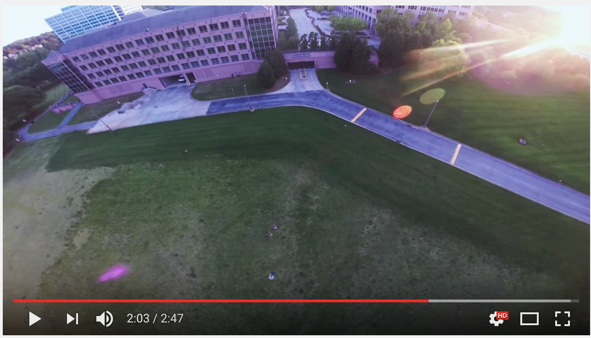

## Quadcopter Software Repository
### Abstract
Here you can find relevant Arduino and MATLAB code for the custom Arduino quadcopter projects on [alexhagiopol.com](https://alexhagiopol.com/portfolio/arduino-quadcopter-live-demo/). The individual projects and writeups are linked below with further instructions on how to use the code for your own Arduino UAVs.

### Details
#### Arduino Quadcopter Firmware: 
An Arduino-based quadcopter and handheld controller enabled by custom firmware that allows for deep vehicle programmability. 
The directories associated with this project are `QuadcopterTransmitter`, `QuadcopterReceiver`, `ESC_Calibration`, and `Required Libraries`.
A detailed description of this project is at http://alexhagiopol.com/2014/06/13/arduino-quadcopter-2-preview/. 

#### Arduino Mapping Implementation:
Arduino code that records obstacle locations with a crude simultaneous localization and mapping (SLAM) implementation.
The directories associated with this project are `RoverDisplayPathway` and `RoverDisplayObstacles`.
A detailed description of this project is at http://alexhagiopol.com/2014/02/04/robotic-cartography-project-introduction/.

#### Kalman Filter Based GPS Localization:
A Kalman Filter based estimation scheme for quadrotors equipped with GPS receivers. 
Prototyped in MATLAB. Implemented and tested in Arduino on live quadrotor hardware. 
The Arduino implementation is compatible with the Arduino Quadcopter system from above.
The directories associated with this project are `Kalman Filter for Quadrotor GPS` and `Required Libraries`. 
A detailed description of this project is at https://alexhagiopol.com/portfolio/arduino-quadcopter-2-0-kalman-filter-location-estimation/. A brief description is in this research poster:

### Live Flight Demo

